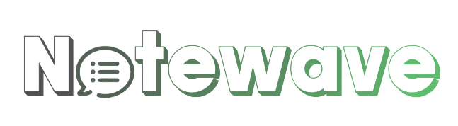

<div align="center">
    
</div>

**Notewave** is a platform, which gives you an opportunity to take notes from your device.

## How to see/start my React Native (Expo) Project ? 📱

**Download and install** [Node.js](https://nodejs.org/en/) 
then clone this repository to your computer using Git

```shell 
git clone https://github.com/GiorgiNefaridze/notewave
```

now you have an access to my project, all you need to do is install all the dependencies

```js
npm i
```

now it is the time to start project with following command

```js
npm start
```

it will execute **expo start** 👀.

Final step is to download Expo application on mobile to see the project.You can download on [Android](https://play.google.com/store/apps/details?id=host.exp.exponent&hl=en&gl=US) as well as on [IOS](https://apps.apple.com/us/app/expo-go/id982107779)

run the project on your device and scan the QR Code. Have fun 🚀